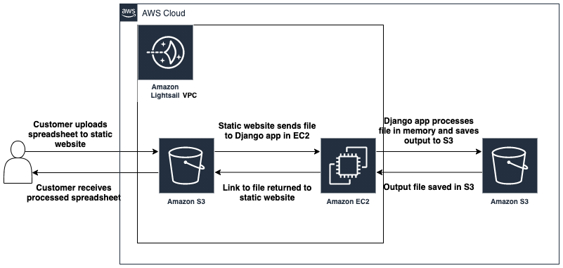
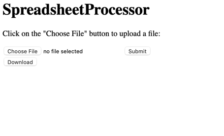
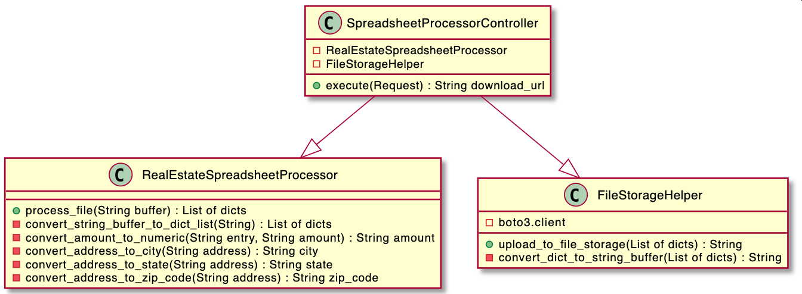
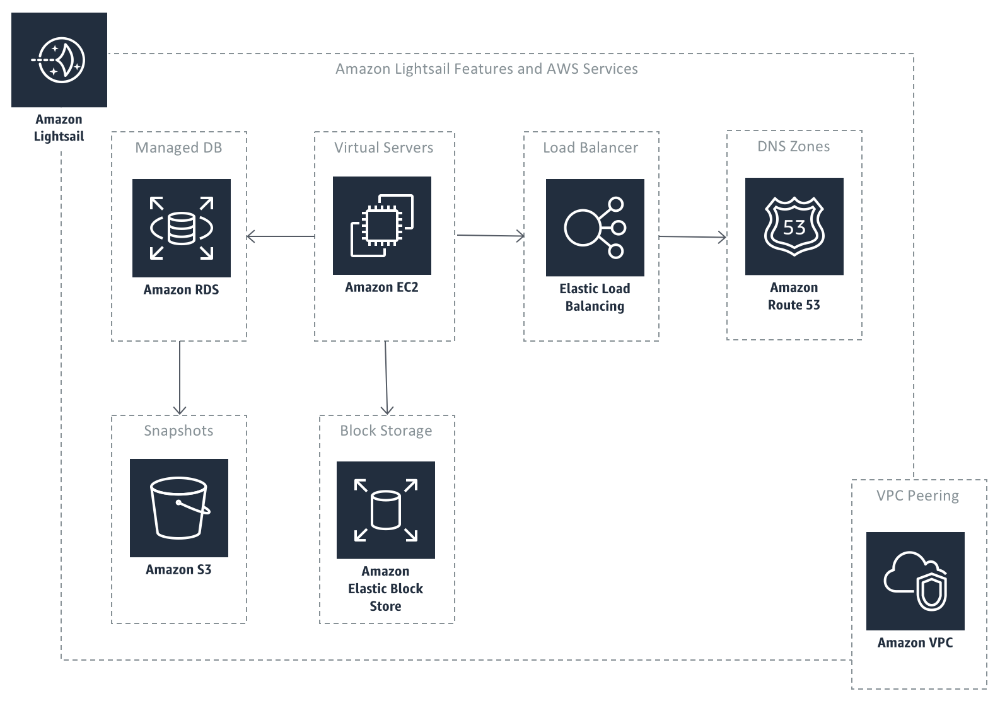

# SpreadsheetProcessorWebApp Design

## User stories
* As a user, I want to be able to upload a spreadsheet (ex: .csv, .xlsx) and receive an output file in the same file 
format but data cleaned
* As a user, I want all columns containing financial data to be convereted from text to numbers
* As a user, I want new metadata columns added breaking out address fields into individual columns

### Example tables

#### Input file

| Address                         | Date       | Entry  | Amount       | Notes         |
| ------------------------------- | ---------- | ------ | ------------ | ------------- |
| 123 W Main St, Boise, ID, 12345 | 01/01/2021 | Credit | USD $2000.00 | Rent received |
| 123 W Main St, Boise, ID, 12345 | 01/06/2021 | Debit  | USD $50.00   | Drywall patch |
| 123 W Main St, Boise, ID, 12345 | 01/06/2021 | Debit  | USD $123.00  | Landscaping   |

#### Output file

| Address                         | Date       | Amount   | Notes         | City  | State | Zip code |
| ------------------------------- | ---------- | -------- | ------------- | ----- | ----- | -------- |
| 123 W Main St, Boise, ID, 12345 | 01/01/2021 | $2000.00 | Rent received | Boise | ID    | 12345    |
| 123 W Main St, Boise, ID, 12345 | 01/06/2021 | -$50.00  | Drywall patch | Boise | ID    | 12345    |
| 123 W Main St, Boise, ID, 12345 | 01/06/2021 | -$123.00 | Landscaping   | Boise | ID    | 12345    |

## Architecture Diagram

For our architecture, we will mainly rely on Amazon Lightsail to manage our infrastructure. Amazon Lightsail bundles all
the AWS resources you for a simple web application (See Appendix 1 for more detail). The above diagram simplifies a lot 
of what Lightsail provides but at the highest level, Lightsail will host a static website on S3 and rely on EC2 for 
compute needs. 

In our initial user stories, the workflow will have the following steps:
1. Customer visits static website
2. Customer uploads spreadsheet to static website
3. Django app in EC2 instance will process the file in-memory
4. After the file is processed Django app will save file to S3 bucket (with time based expiration)
5. Download link is returned to static website so output file can be downloaded by customer

## P0 requirements
* Ability to process .csv files
* Only ability to process files in exact format of `Input file`
* Ability to exract City, State and Zip code from US addresses in `Address` column
* Ability to convert `Entry` and `Amount` to numberic `Amount` column
  * `Entry` will be used to determine if the value is positive or negtive
  * `Amount` will be convered from a text field to numeric

### Mock up

## Low level design

### Class Diagram

### High level code flow
1. `SpreadsheetProcessorController` receives request file as a String
2. String buffer is sent to `RealEstateSpreadsheetProcessor` for processing
3. The String buffer is converted to a list of dictionaries to represent a table
4. `RealEstateSpreadsheetProcessor` iterates over each row adding the new columns using helper methods (Ex. `convert_address_to_city`)
5. Unused columns are dropped (Ex. `Entry`)
6. Processed list of dictionaries is returned to `SpreadsheetProcessorController`
7. `SpreadsheetProcessorController` sends the processed list of dictionaries to `FileStorageHelper`
8. `FileStorageHelper` converts the list of dictionaries to a String buffer so it can be uploaded to S3
9. `FileStorageHelper` uploads file to a expiration limited S3 bucket and returns the download URL to `SpreadsheetProcessorController`
10. `SpreadsheetProcessorController` returns this URL to the front end, enabling the `Download` button on the UI

### Key decisions

#### Pandas vs. List of dictionaries

Pandas is a popular python library that abstracts a lot of functionality for processing tabular data in python. For this 
application we are intentionally avoiding using this library.

Pandas is a large library with a lot of different functionality for data analysis and manipulation. For our basic use 
case, most of this functionality is not needed and will increase our dependency size greatly. For EC2 this likely won't 
cause issues, however if we were to host this application using AWS Lambda in the future we may run into depency size 
limits.

A list of dictionaries can provide the same data structure while keeping dependencies and application much more 
lightweight with the tradeoff of requiring slightly more code to manage your data structure.

## Future improvement ideas
* Batch upload functionality
* Add ability to process more file types (Ex. xlsx)
* Ability to select a `template` to process from a drop down list
  * Ex. real estat file as seen above + other file type with different requirements
* Create custom `Table` data structure that abstracts table operations

## Appendicies

### Appendix 1: What is Lightsail?

Amazon Lightsail is a cloud service offered by Amazon Web Services (AWS) that bundles cloud compute power and memory.

Lightsail packages memory, processing, storage and transfer into virtual machines (VMs) for customers to purchase, then 
releases that compute capacity as Amazon Elastic Compute Cloud (EC2) instance. Amazon Lightsail derives its compute 
power from an EC2 instance. Amazon EC2 is a web service that provides secure, configurable compute capacity in the 
cloud.

All plans include a static IP address, intuitive management console, secure shell terminal access, remote desktop access
, domain name server management and server monitoring. Customers also have access to AWS tools.

